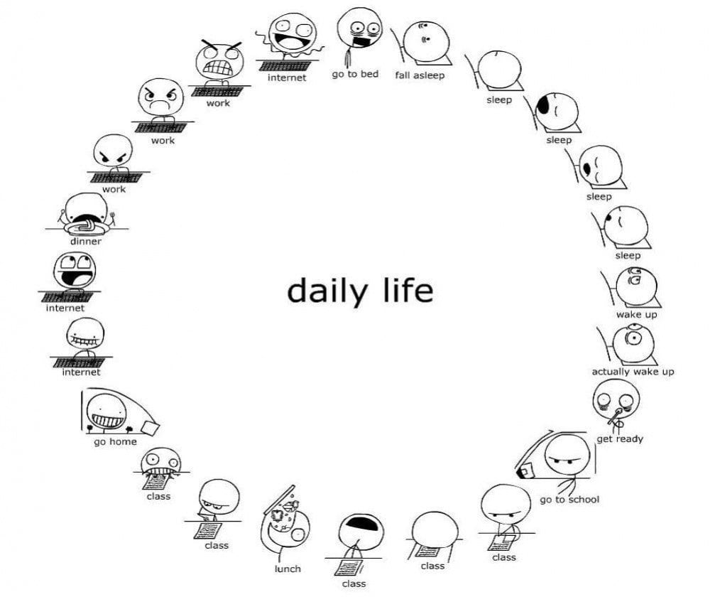

# Existential Psychology Lecture by Eric Dodson (University of West Georgia)

알베르 카뮈 (1913-1960)  
시지프 신화 (1940)

"위대한 행동과 위대한 사상들은 모두 그 시작에서는 특별할 것이 없다." (27쪽, 시지프 신화, 열린책들)
   

## 철학적 자살과 부조리한 것들  
  
카뮈의 <시지프 신화>에서 가장 핵심적인 질문은 아마도 이것입니다: 삶의 근본적인 부조리와 허무함을 알면서도 계속 살아가고자 하는 것이 가능한가?  
따라서 '자살'에 대한 질문은 카뮈에게 있어 '가장 중요한 철학적 질문'입니다.  
그가 말했듯이  
  
>"정말로 진지한 철학적 문제는 오직 하나, 그것은 바로 자살이다. 인생이 굳이 살 만한 가치가 있는 것인지 아닌지를 판단하는 것, 그것은 철학의 근본적 질문에 대답하는 것이다. 그 외에 세계가 3차원인지 아닌지, 이성의 범주가 아홉 개인지 열두 개인지의 문제는 그 다음이다. 이런 문제들은 장난이다." (15쪽)
  
카뮈에게 자살 의지는 삶의 부조리와 허무의 무게를 견디지 못하는 데서 비롯됩니다. 그러나 여기서 자살은 단어 그 의미대로의 자살뿐만 아니라 "**철학적 자살**"을 포함합니다. 생물학적 자살과 마찬가지로 철학적 자살도 삶의 부조리한 본질에 대한 불안한 대면을 회피하기 위한 전략입니다. 그러나 철학적 자살은 인생의 풀리지 않는 질문과 불확실성에 대한 차분한 '해답'을 제공함으로써 이러한 회피를 달성합니다. 본질적으로 철학적 자살은 임시방편적인 해답을 제공함으로써 자신의 존재에 대한 성가신 수수께끼를 종식시키려는 시도입니다.  
  
아마도 철학적 자살의 가장 명백한 예는 **신에 대한 믿음**일 것입니다. 우리는 일반적으로 왜 신을 믿을까요? 카뮈의 관점에서 보면, 우리는 일반적으로 신을 믿는 이유는 첫째, 존재에 어떤 궁극적인 질서, 어떤 감동과 목적이 있다고 느끼기를 갈망하기 때문입니다. 우리는 인간이기 때문에 "우주는 어디에서 왔을까?", "삶이란 궁극적으로 무엇일까?", "죽으면 우리는 어떻게 되는 걸까?" 같은 근본적인 질문에 자연스럽게 관심을 갖게 됩니다. 그러나 이러한 기본적인 질문에 대한 구체적인 답을 찾기 위해 삶 자체를 바라보면, 우리는 거의 또는 전혀 답을 얻지 못합니다. 삶 자체가 어디에서 왔는지, 어디로 가는지, 그 안에서 우리의 역할이 무엇인지, 심지어 삶의 의미가 있는지조차 명확하지 않은 경우가 많습니다. 하지만 동시에 이러한 질문에 대한 답을 찾고자 하는 우리의 열망은 너무나 깊기 때문에, 우리는 이러한 질문이 답이 없는 채로 놓여진 상황을 견딜 수 없습니다. 그래서 우리는 신을 믿기 시작하거나 혹은 삶의 궁극적인 감동과 목적을 제공하는 것처럼 보이는 다른 모든 것을 믿기 시작합니다. 요컨대, 신을 믿는다는 것은 삶의 불확실성에 대한 의문을 차단하고, 따라서 삶과 그 삶의 목적에 대한 근본적인 질문에 답을 찾고자 하는 절박한 불안감을 없애주기에 매력적입니다. (물론 이러한 기능은 과학이나 상품 문화와 같은 세속적 방법으로도 쉽게 충족될 수 있습니다.)  
  
우리가 신(또는 다른 종교적 구성물)을 믿는 또 다른 이유는 **정의**에 대한 갈망과 관련이 있습니다. 다시 한 번 말하지만, 우리는 인간이기 때문에 착한 사람은 합당한 보상을 받고, 불의한 사람은 응분의 대가를 치르기를 원합니다. 그러나 삶은 그 어떤 것도 보장하지 않습니다. 가장 탐욕스럽고 교활한 자들이 상처 없이 행복하게 떠나는 경우가 많으며, 선한 사람들이 종종 인생의 고통을 고스란히 떠안는다는 것을 살아가면서 우리는 깨닫게 됩니다. 우리는 이러한 명백한 현실에 대한 불안과 도덕적 불확실성을 완화하기 위해 신을 믿습니다. 즉 신을 믿는 이유는 인간은 정의가 실현되기를 갈망하나, 우주는 이에 침묵으로 일관하기 때문입니다.
  
카뮈는 근원적 질문에 대한 합리적인 해답과 정의로움에 대한 우리의 깊은 열망과 우주의 불합리한 침묵 사이의 이러한 긴장 또는 "대립"을 " **부조리**"라고 부릅니다. 그는 "부조리는 인간의 호소(욕구)와 세계의 비합리적 침묵 간의 이러한 대면에서 태어난다."(47쪽)고 말합니다. 여기서 부조리는 인간의 자유와 창의성 등 우리 인간 존재의 전체 구조에 걸쳐 있습니다. 따라서 부조리는 단순한 경험의 종류라기보다는 하나의 **존재론적 범주**의 지위를 갖습니다. 즉, 부조리는 인간과 우주의 통일성에서 환원할 수 없는 측면이며, 존재 자체는 본질적으로 부조리한 것입니다.  
  

카뮈는 부조리한 것에 대한 감각을 차단하는 철학적 자살이 당연히 흔하다고 생각하지만, 그것이 가장 바람직한 대응인지에 대해서는 의문을 제기합니다. 사실 카뮈에게 더 바람직한 대안은 삶의 불확실성과 모호함을 용인하는 법을 배움으로써 삶의 근본적인 부조리를 포용하는 삶의 방식을 기르는 것입니다. 그는 이러한 대안적 삶의 방식을 **부조리의 인간**이라고 부릅니다. 부조리의 인간은 인생의 근본적인 질문을 열어두고 답을 찾지 않으며, 결과적으로 철학적 자살을 거부합니다. 카뮈는 "(어떤 비약도 하기 전에) 그 현기증 나는 모서리 위에서 균형을 잃지 않고 버틸 줄 아는 것, 이것이 바로 정직한 것이고 나머지는 핑계에 불과하다."(77쪽)라고 썼습니다. 결과적으로 카뮈의 입장은 철저한 **무신론**의 입장입니다. 신을 믿는다는 것은 삶의 내재적 불확실성과 함께 부조리한 것을 외면하기 때문입니다. 삶의 근본적인 신비를 미스터리로 남겨두고 근원적인 질문을 열어두는 것에 대한 강조는 **커크 슈나이더**의 "매혹적인 불가지론"(경외감의 재발견 참조)이라는 21세기의 표현에서도 찾아볼 수 있습니다. 여기서 삶의 부조리와 신비를 포용하는 것은 삶의 실제 텍스트에 충실할 수 있는 방법일 뿐만 아니라, 신비와 경외감을 경험할 수 있는 더 크고 중심적인 장소를 제공함으로써 삶을 다시 매혹시킬 수 있는 잠재력을 지니고 있습니다.
  
따라서 카뮈에게 삶은 기본적으로 우리에게 삶의 근본적인 부조리를 인정하고 심지어 축하하라고 요구합니다. 물론 우리는 우리가 어디에서 왔는지, 어디로 가는지, 심지어 어떤 결정적인 지점이 있는지도 모릅니다. 동시에 우리는 이런 기본적인 삶의 질문에 대한 명확하고 구체적인 답을 갈망합니다. 하지만 이 터무니없는 무지의 상태는 사실 근본적인 자유의 조건에 지나지 않는 것 아닐까요? 다시 말해, 우리는 인생의 수수께끼에 대한 구체적인 답이 없기 때문에 자유로우며, 선험적인 '답'의 틀에 얽매이지 않고 자신만의 독특한 인생의 답을 창조할 수 있는 자유를 누리고 있는 것입니다. 동시에, 삶의 무궁무진한 영역에서 자유로워진 자신을 발견하면 열정과 열정, 그리고 새로운 활력과 축하의 마음으로 삶을 창조할 수 있는 기회를 얻게 됩니다.  
  
  
## 반복과 무의미함  
  
부조리의 더 큰 문제는 삶의 반복적이고 허무한 측면과 관련이 있을 것입니다. 여기서 카뮈는 우리 삶의 많은 현실을 (신들로부터 무익한 노동의 무한한 '삶', 즉 큰 바위를 산 위로 밀어 올렸다가 다시 굴러 내려오는 끝없는 반복을 하라는 저주를 받은) **시지프**의 고전 신화와 비교합니다. 카뮈가 시지프를 "**신들의 프롤레타리아**"(188쪽)라고 부르는 이유는 바로 우리 자신의 삶이 시지프의 상황과 너무나 일치하기 때문입니다. 예를 들어, 이 에세이를 읽는 것(지금 여러분이 하고 있는 일)이 다른 수업의 다른 독서를 읽는 것과 매우 비슷하다는 것을 눈치채셨나요? 내용은 조금 다르지만, 중요한 사실은... 여러분이 지금까지 수강한 수백 개의 수업에 대한 또 다른 읽기(아마도 이 시점까지 수천 개의 다른 읽기처럼)일 뿐이라는 것입니다. 다시 말해, 어느 정도 수준에서는 학생으로서 여러분이 하는 거의 모든 일은 이미 알고 있는 다른 것들을 반복하는 것입니다. 물론 멀지 않은 미래에 어느 시점에 여러분은 직장 세계로 전환하게 될 것이고, 그 세계는 다소 달라질 것입니다. 하지만 그 때 가장 중요한 것은 아마도 여러분이 학교를 시작할 때 그랬고, 중학교에 진학했을 때 그랬고, 고등학교에 진학했을 때 그랬고, 대학교에 진학했을 때 그랬던 것처럼 새로운 반복에 적응하는 것이겠죠... 여러분은 큰 그림을 이해하실 겁니다. 여기서 요점은 시지프처럼 우리 삶에도 대부분 반복적인 성격의 격렬한 노동이 많이 포함된다는 것입니다.  
  

그러나 시지프와 더 문제가 되는 유사성은 아마도 우리의 노력이 궁극적으로 어떤 결과를 가져올 것이라고 믿을 만한 특별한 이유가 없다는 전망에 있습니다. 예를 들어, 여러분은 반복적인 행동임에도 불구하고 읽는 다는 것이 궁극적으로 자신을 더 나은 사람으로 만들어줄 것이라는 믿음을 가지고 이 글을 읽고 있을지도 모릅니다. 하지만 깊고 불안한 현실은 결국 당신도 다른 사람들처럼 그저 죽어서 오랫동안 잊혀질 뿐이라는 것 아닐까요? 결국에는 묘비조차 먼지로 변해버릴 것이고, 좋은 사람이 되기 위해 열심히 노력했는지 여부는 궁극적으로 그 누구에게도, 그 무엇에도 중요하지 않을 것입니다. 아니면 열심히 일한 덕분에 중요한 일을 성취하거나 세상에 가치 있는 기여를 할 수 있을 거라고 생각할 수도 있습니다. 하지만 인생의 깊은 현실은 결국 모든 최고의 성취와 공헌이 잊혀지고 중요하지 않게 된다는 것이 아닐까요? 물론 이러한 종류의 불안한 감정에 대한 일반적인 반응 중 하나는 자신에게서 벗어나 자신의 삶의 하찮음을 초월하는 것처럼 보이는 것, 예를 들어 자녀를 갖는 것과 같은 것으로 강조점을 옮기는 것입니다. 그러나 자신의 삶이 궁극적으로 아무 의미도 없을 것이라는 것이 전적으로 그럴듯하기 때문에 개인의 삶의 중요성에 의문이 든다면, 자녀의 삶도 다를 것이라고 기대할 이유가 있을까요? 아니면 자녀들에게도요? 아니면 인류 전체를 위해서도요? 물론 우리 인간은 우리가 하는 일이 중요하고 인류가 우주의 대 전환에 필수적인 존재라고 생각하고 싶어 합니다. 하지만 우주는 우리 인간의 갈망과 인간의 업적에 완전히 무관심하다는 사실을 인정하는 것이 더 정직하지 않을까요? 언제든 우주는 공룡에게 그랬던 것처럼 임의의 소행성이나 불쾌한 새로운 전염병으로 우리를 순식간에 멸종시킬 수 있다는 것은 불쾌한 삶의 사실이 아닐까요? 여기서 중요한 점은 시지프처럼 우리도 반복적인 노동이 어떤 결과를 가져올지 전혀 보장할 수 없는 존재라는 점이며, 이는 인류 전체에게도 마찬가지라는 것입니다. 

그러나 우리의 실존적 상황을 부조리하게 만드는 것은 단지 우리가 헛된 노동으로 가득 찬 삶을 살아가지만 그것이 어떤 결과를 가져온다는 보장이 없다는 것만이 아닙니다. 결국, 탄생/생존/번식/사망의 끝없는 순환으로 정의되는 동물계 전체의 상황도 마찬가지입니다. 이와는 대조적으로 인간의 존재가 특히 부조리한 이유는 우리가 그것을 **의식**하고 있다는 점입니다(또는 적어도 그렇게 할 수 있다는 점). 바로 이 지점에서 시지프의 형벌처럼 우리 존재의 부조리함이 일종의 정죄의 성격을 띠게 됩니다. 

  
## 희망의 부재와 무의미함

불멸의 존재인 시지프는 당연히 완전히 희망이 없는 상황에 처하게 됩니다. 그러나 카뮈에게 있어서 우리의 필멸의 삶은 현실적으로 **희망이 없고 무의미**한 것이기도 한데, 이는 우주가 특별히 우리에게 희망이나 의미를 제공하지 않기 때문입니다. 카뮈에게 있어 우리의 삶과 성취의 의미를 믿는다는 것은 대부분 삶이 우리의 의미에 대한 구체적인 확신을 전혀 제공하지 않는다는 불쾌한 현실을 회피하기 위한 방법이라는 것을 이미 살펴보았습니다. 마찬가지로, 삶은 우리의 희망과 목적 의식을 긍정하는 만큼이나 자주 무너뜨리기 때문에 삶 자체가 희망이나 의미에 삶의 중심을 두어야 할 이유가 없습니다. 다시 말해, 의미와 마찬가지로 희망과 의미는 대부분 삶 자체가 긍정할 수도 있고 그렇지 않을 수도 있는 가능성에 중점을 두는 방식이며, 현실은 삶이 우리가 생각하는 성취나 희망, 의미와 특별히 관련이 없다는 겁니다. 삶은 우리의 희망과 의미에 무관심합니다. 따라서 카뮈는 희망과 의미를 인간의 조작물, 일종의 질병, 산만함, 당장의 현실에서 벗어나게 하는 원인, 즉 철학적 자살의 한 형태로 간주합니다. 그리고 인간의 의미와 그에 따른 삶의 질에 대한 감각은 본질적으로 인위적인 것이기 때문에, 카뮈는 삶에서 정말로 중요한 것은 삶의 질이 아니라 단순히 양, 즉 얼마나 많은 것을 얻었는가라는 더욱 충격적인 주장을 펼칩니다: "...중요한 것은 가장 잘 사는 것이 아니라 가장 많이 사는 것이라고 나는 말해야 한다."(92쪽).

  
## 실존적 반항 
  
그러나 카뮈에게 삶의 부조리, 반복되는 허무와 절망을 충분히 인식하고 살아갈 수 있는지, 아니면 궁극적으로 어떤 종류의 자살에 의지해야 하는지는 여전히 열린 질문으로 남아 있습니다. 카뮈는 <시지프 신화>에서 부조리한 상황에 대한 두 가지 가능한(그리고 서로 연관된) 대응을 설명합니다. 이 반응 중 하나는 도스토예프스키의 『지하로부터의 노트』에 나오는 '악의'와 같은 실존적 반항의 한 형태인 '경멸'(187쪽, 188쪽)과 관련이 있습니다. 시지프는 자신의 운명에 대해 터무니없이 부질없는 상황으로 자신을 정죄하는 신들을 경멸한다(사실상 자신을 정죄한 신들을 정죄하는 것이다). 카뮈는 말합니다. "경멸로서 극복되지 않는 운명이란 없는 것이다."(188쪽).

  
사실 이런 종류의 반항은 부조리에서 빼놓을 수 없는 요소입니다. 그래서 카뮈는 부조리를 "대립, 분열, 절연"(67쪽)으로 묘사합니다. 그의 말대로, "부조리란, 오직 우리가 그것에 순순히 동의하지 않는 한에서만 의미를 갖는다"(61쪽). 다시 말해, 부조리한 것을 '수용'하려는 시도는 그 본질적 성격을 왜곡하고 철학적 자살의 길로 인도합니다. 이것은 일종의 역설입니다. 한편으로 카뮈가 권장하는 '명료함'은 부조리에 대한 완전한 인식을 요구하지만, 다른 한편으로는 부조리에 대한 도전적인 비수용을 요구하기도 합니다. 이러한 반항 또는 '반란'의 요소는 문자 그대로의 자살이 부조리에 대한 실행 가능한 대응이 되지 못하게 하는 요소이기도 합니다. 카뮈가 말했듯이 "(부조리에 대한) 의식과 반항이라는 이 거부는 포기의 정반대이다... 중요한 것은 완전히 동의하고 죽는 것이 아니라, 화해하지 않고 죽는 것이다... 부조리한 인간이 할 수 있는 것은 모든 걸 소진하고 자기 자신까지 다 소진하는 것 뿐이다."(85쪽).
  
   
## "시지프가 행복한 모습을 상상해야 한다." 
  
카뮈의 두 번째 반응은 부조리에 대한 인식을 삶을 더욱 온전히 포용하는 기회로 삼는 것과 관련이 있습니다(니체의 『영원한 반복』의 그늘). 물론 이것은 역설의 또 다른 차원을 설정합니다. 어떻게 우리는 무언가를 수용하면서 동시에 그것을 거부하는 도전적인 비수용을 즐길 수 있을까요? 그러나 카뮈에게는 이것이 바로 인생의 본질적이고 역설적인 과제입니다. 우리가 갈망하는 것, 즉 인간의 중요성, 희망, 의미에 대한 구체적인 감각을 제공하지 못하는 존재를 어떻게 포용할 수 있을까요?  
  
시지프는 또한 그 반복과 궁극적인 허무함을 충분히 의식하고 있음에도 불구하고 자신의 과제를 실제로 수용함으로써 자신의 비난에 응답합니다. 카뮈는 "이 돌 부스러기 하나하나가, 캄캄한 밤 이 산의 광물의 섬광 하나하나가, 그것만으로도 하나의 세계를 이룬다. 무수한 산정(山頂)들을 향한 투쟁, 그것만으로도 인간의 마음을 가득 채우기에 충분하다."(208쪽)라고 말합니다. 시시포스는 자신의 과업을 포용하고 받아들임으로써, 그리고 자신이 처한 상황의 각 요소가 일종의 마법으로 가득 차도록 허용함으로써 비난의 성격을 부정하고 실제로 자신의 운명에 만족하게 된다. 어떤 의미에서 자신의 운명을 받아들이는 것은 시지프의 궁극적인 반항입니다. 왜냐하면 그렇게 함으로써 정죄의 성격을 부정하기 때문입니다(예를 들어 감옥에 독방에 갇힌 티모시 리어리의 반응을 생각해 보세요 "유명인으로서의 삶과 현대사회의 현기증 나는 복잡함에서 벗어나 천천히 흐르는 시간과 함께 명상할 수 있는 멋진 순간이었다.") 따라서 카뮈는 삶의 반복성과 허무함에 대한 '비난'에 대해 한편으로는 명료하고 도전적으로 의식하고, 다른 한편으로는 그럼에도 불구하고 그것에 매혹되어 궁극적으로 자신의 역할에 만족하는 반응을 보였습니다.  

   
## 우리 삶과의 관련성
  
우리가 일반적으로 바쁨과 생산성에 부여하는 의미를 생각해 보면 카뮈의 많은 분석이 우리 삶에서 설득력을 얻는 것 같습니다. 바쁘고 생산적인 학자(또는 학생)가 사실상 훌륭한 학자(또는 학생)인 것처럼 여겨지는 학계에서 특히 그렇습니다. 하지만 카뮈의 넓고 포괄적인 관점에서 보면, 우리가 바쁘고 생산적이라고 부르는 것은 대부분 반복의 문제일 뿐입니다. '발견'으로 보이는 것조차도 최종적으로 분석해 보면 새로운 것을 발견하려는 오래된 게임의 반복, 즉 역사적으로 반복되어 온 역학 관계의 반복에 불과합니다. 물론 발견의 내용이 참신하고 심지어 지구를 뒤흔드는 것처럼 보일 수도 있지만, 가장 중요한 현실은... 그 이전의 수많은 발견과 마찬가지로, 그리고 앞으로도 무한히 계속될 수많은 발견과 마찬가지로 지구를 뒤흔드는 또 다른 발견에 불과하다는 것입니다.  
  
자신을 바쁘고 생산적이며 성공적이라고 생각하는 일반적인 투자의 불합리한 본질을 깨닫는 것은 강박적이고 모든 것을 소비하는 일부 집착에 유익한 디플레이션 효과를 가져올 수 있는 것 같습니다. 결국 인생은 우리가 성공했는지 아닌지, 어떤 방식, 형태, 형태로든 바쁘거나 생산적인지 여부에 특별히 신경 쓰지 않는 것일 수도 있지 않을까요? 어쩌면 바쁨, 생산성, 성공과 같은 것들이 삶에 필수적인 것처럼 보이는 것은 우리가 그렇게 정의하고 있기 때문일지도 모릅니다. 그리고 우리는 더 심오한 가치를 쉽게 선택할 수 있습니다.  
  
따라서 저는 우리 자신을 바쁘고 생산적이며 성공적이라고 생각하는 우리의 일반적인 집착이 삶 자체가 우리에게 제공하는 실제 지혜와 상충되며, 결과적으로 우리가 알고 있는 존재에 대해 일종의 허무주의적 자세를 취하고 있다고 제안하면서 결론을 내리고 싶습니다. 그냥 생각입니다. 좋은 하루 되세요.  
  
